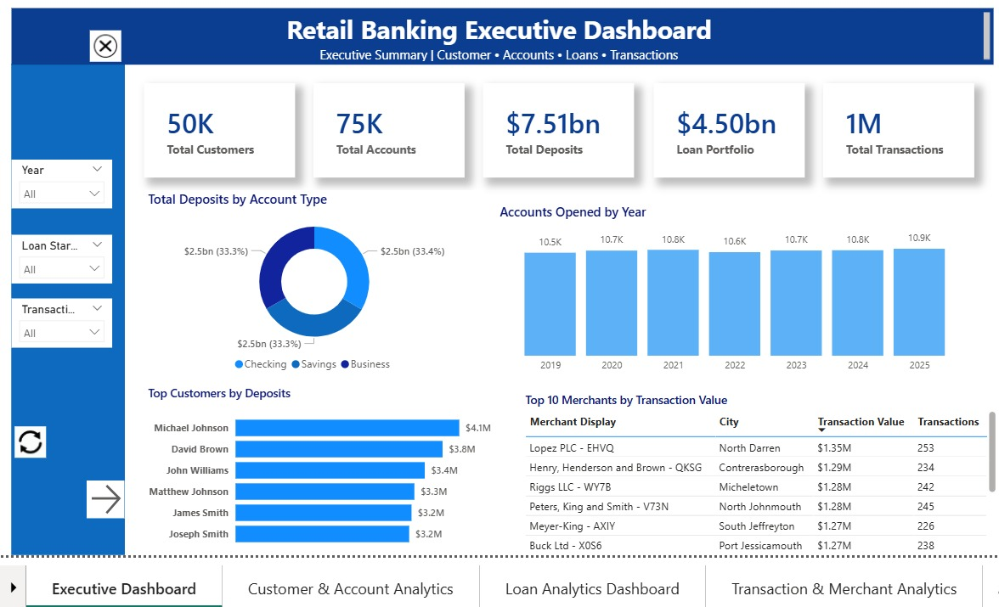
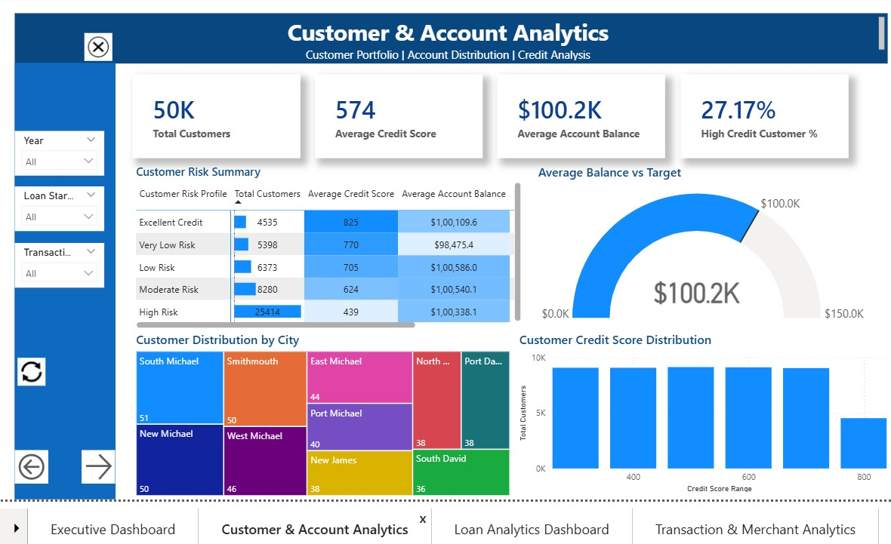
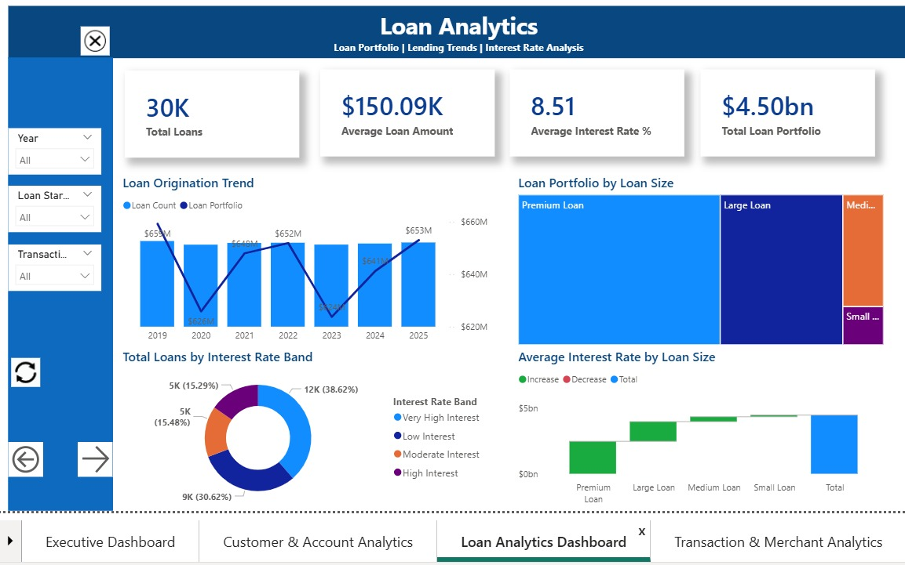
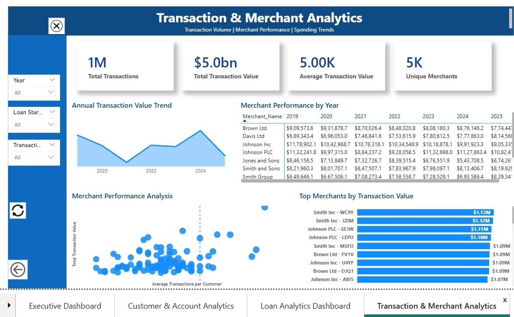

# 🏦 Retail Banking Analytics Dashboard

## 📌 Project Overview

This project is an interactive **Retail Banking Analytics Dashboard** developed using **Microsoft Power BI**. The dashboard provides actionable insights into customer behavior, account performance, loan portfolio, and transaction trends to support data-driven decision-making in a retail banking environment.

The project demonstrates end-to-end business intelligence development, including data transformation, data modeling, DAX calculations, interactive visualizations, and user-friendly report navigation.

---

## 🎯 Business Objectives

The dashboard enables business users to:

- Monitor key banking KPIs
- Analyze customer demographics and account performance
- Evaluate loan portfolio and lending trends
- Monitor transaction volume and merchant activity
- Identify high-value customers and merchants
- Support data-driven business decisions

---
## 📊 Dashboard Pages

### 1️⃣ Executive Dashboard

Provides an overview of the bank's overall performance through key performance indicators (KPIs), customer segmentation, account balances, loan portfolio, and transaction summary.

---

### 2️⃣ Customer & Account Analytics

Provides detailed insights into customer demographics, account balances, account types, and customer distribution across different regions.

---

### 3️⃣ Loan Analytics

Analyzes loan portfolio performance, loan types, interest rates, loan status, and lending trends to support financial decision-making.

---

### 4️⃣ Transaction & Merchant Analytics

Analyzes transaction trends, merchant performance, transaction values, and customer spending behavior through interactive visualizations.

---
## 🛠️ Tools & Technologies

- Microsoft Power BI
- Power Query
- DAX (Data Analysis Expressions)
- SQL Server
- Microsoft SQL Server Management Studio (SSMS)
- GitHub
- Microsoft Excel

## ⭐ Key Features

- Interactive Executive Dashboard
- Customer & Account Analysis
- Loan Portfolio Analysis
- Transaction & Merchant Analytics
- KPI Cards
- Drillthrough Report
- Custom Report Tooltips
- Bookmark-based Navigation
- Collapsible Navigation Menu
- Reset Filters
- Dynamic DAX Measures
- Synchronized Slicers
- Professional Dashboard Design

## 📷 Dashboard Preview

### 🏦 Executive Dashboard



---

### 👥 Customer & Account Analytics



---

### 💰 Loan Analytics



---

### 💳 Transaction & Merchant Analytics



---
## 📂 Repository Structure

```text
Retail-Banking-Analytics-Dashboard
│
├── README.md
├── Dataset/
├── Code/
├── Screenshots/
```
## 📥 Download Power BI Dashboard

The complete Power BI dashboard (.pbix) file is available here:

🔗 **Download Dashboard:** *(https://drive.google.com/file/d/1qKFMffrt9c_OipyjB1lyxL790ZpoGZ38/view?usp=sharing)

## 📊 Dataset

This project uses a publicly available **Retail Banking Dataset** from Kaggle.

Due to GitHub file size limitations, the complete transaction dataset is not included in this repository.

The original dataset can be accessed from Kaggle.

## 💡 Skills Demonstrated

- Data Visualization
- Dashboard Design
- Data Modeling
- Power Query
- DAX Calculations
- SQL Query Writing
- Business Intelligence Reporting
- Interactive Dashboard Development
- Data Storytelling

## 📈 Key Business Insights

The dashboard enables business users to quickly identify:

- Customer demographics and account distribution
- Loan portfolio performance and lending trends
- Transaction volume and value across different years
- Merchant performance and customer spending behavior
- Key banking KPIs through an executive dashboard
- Interactive drill-through analysis for deeper business insights

## 🔮 Future Enhancements

- Publish the dashboard to Power BI Service
- Implement Row-Level Security (RLS)
- Add incremental data refresh
- Integrate real-time transaction data
- Build mobile-optimized report layouts

## 👩‍💻 Author

**Pooja Madappa**

- Data Analyst
- BI Analyst 
- SQL | Python | Azure
- Based in Ireland
